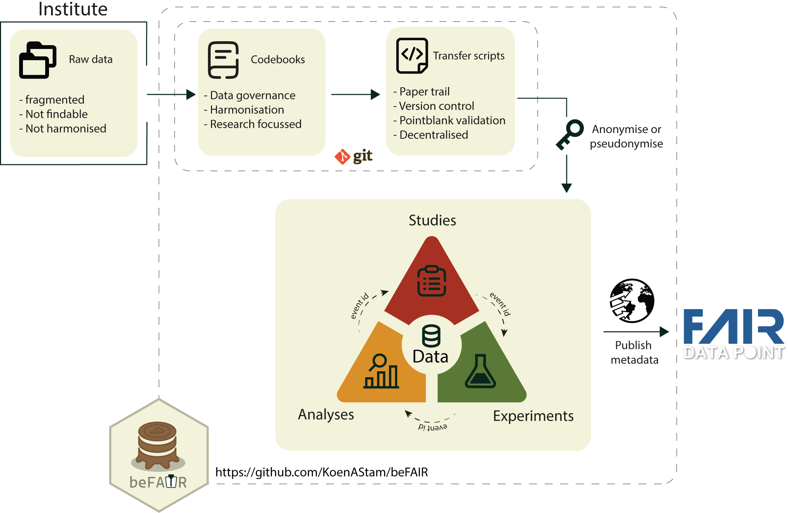

# beFAIR 

beFAIR is an R package for managing and harmonizing clinical research data following FAIR principles. It provides a codebook-driven ETL framework that links clinical studies, immunological experiments, and downstream analyses through a shared SQL database.

## Features

- **Structured project layout** — scaffold studies, experiments, and analyses with a single function call
- **Codebook-driven schemas** — define data tables in YAML; beFAIR creates and maintains SQL tables automatically
- **Reproducible ETL scripts** — draft, run, and version-track R scripts that extract, transform, and validate your data
- **Stable participant IDs** — pseudo-anonymize participants across studies using SHA-256 derived identifiers
- **Built-in validation** — validate datasets against codebook rules before loading, powered by `pointblank`
- **Multi-study harmonization** — link participants and events across studies and experiments through a shared schema

## Getting started

See the [getting started guide](articles/start_here.html) for an introduction, or jump to a specific topic:

- [Starting a project](articles/starting_a_project.html)
- [Adding a study](articles/adding_a_study.html)
- [Adding an experiment](articles/adding_an_experiment.html)
- [Codebook reference](articles/codebooks_reference.html)
