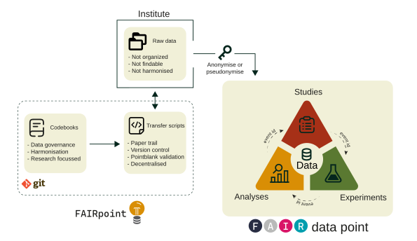

```{r setup, include=FALSE}
knitr::opts_chunk$set(echo = FALSE)
```

## The Problem: Fragmented and Isolated Research Data

Modern clinical research platforms — particularly those running longitudinal
cohort studies or multi-arm vaccine trials — generate data from a wide range
of sources: patient registries, laboratory information management systems,
high-dimensional immunological assays (CyTOF, Olink, ELISA, flow cytometry),
and downstream computational analyses. Each of these data streams typically
arrives in its own format, follows its own naming conventions, and is stored in
its own silo.

The consequences are familiar to anyone who has worked in translational research:

- **Variable names diverge** across studies — `age_at_enrolment` in one
  spreadsheet, `AgeEnrol` in another, and `pt_age` in a third. All describe the
  same thing, yet cannot be merged without bespoke recoding.
- **Source identifiers are not stable**. A participant enrolled in two trials
  will carry a different ID in each — making cross-study linkage error-prone
  and difficult to audit.
- **Metadata is sparse or absent**. Raw data files are passed around without
  documentation of units, allowed values, or derivation logic, making
  reproduction and reuse nearly impossible.
- **Provenance is opaque**. When a result changes between analysis runs, there
  is often no systematic way to trace *which* data transformation caused the
  change, *when* it was introduced, or *by whom*.
- **Interoperability is an afterthought**. Datasets produced for one study are
  rarely formatted to be combined with others, even when the same assay and
  cohort population are used.

These are not edge cases: they represent the default state of multi-study
research platforms that have grown organically over time. The result is
substantial hidden overhead — data engineers spend a disproportionate share of
their time on ad-hoc cleaning rather than on analysis, and the same
harmonization work is often repeated from scratch each time a new study
joins the platform.

---

## The FAIR Principles as a Design Target

The [FAIR data principles](https://www.go-fair.org/fair-principles/),
first formulated by Wilkinson *et al.* (2016), provide a widely adopted
framework for addressing exactly these problems. Data should be:

| Principle | Meaning |
|---|---|
| **F**indable | Data and metadata are assigned persistent identifiers and described with rich, searchable metadata. |
| **A**ccessible | Data can be retrieved through open, standardised protocols; metadata remains accessible even when data are not. |
| **I**nteroperable | Data use shared vocabularies, ontologies, and formats so that they can be understood and combined by humans and machines. |
| **R**eusable | Data are described in sufficient detail that they can be correctly reused for new purposes, by investigators not involved in the original collection. |

FAIR compliance is increasingly required by funding bodies (NIH, NWO, H2020/HE)
and journals, and it is central to open science mandates. Yet in practice,
achieving FAIR compliance in a running multi-study research environment requires
tooling — a structured workflow that enforces standards consistently, without
placing an unreasonable burden on individual researchers.

---

## beFAIR: A Structured Scaffold for Research Data Harmonization

beFAIR is an open-source R package that operationalises the FAIR principles
for clinical research platforms. Rather than retrofitting FAIR compliance onto
existing data after the fact, beFAIR establishes a structured scaffold from
the very first data contribution: a shared, codebook-driven schema, an
auto-generated ETL (Extract–Transform–Load) pipeline, and a version-controlled
audit trail — all within a familiar R environment.

The core idea is straightforward: **every dataset that enters the platform must
conform to a shared codebook before it is admitted to the database**. The
codebook defines variable names, data types, units, allowed categories, and
validation rules. Scripts that load data are drafted automatically from the
codebook and are tracked in a registry. The result is a single, queryable SQL
database in which all studies, experiments, and analyses speak the same language.



---

## How beFAIR Works

### 1. A Shared Vocabulary: Codebooks

The foundation of beFAIR is its **codebook system**. Each database table is
defined by a YAML codebook file that specifies:

- the canonical name of every variable,
- its data type and SQL type,
- its units and allowed categories or labels,
- point-in-time validation rules (e.g., age must be between 0 and 120).

```yaml
age:
  description: Age of subject at enrollment, in years.
  units: years
  type: numeric
  type_sql: DECIMAL
  validations:
    - col_vals_between:
        left: 0
        right: 120
        na_pass: true
```

beFAIR ships with a library of built-in codebooks that cover the common data
entities in clinical immunology research: study participants, study arms, adverse
events, sample metadata, and outputs from assays including CyTOF, Olink,
ELISA, Aurora, LC-MS, glycan arrays, and computational clustering analyses.
Projects can extend this library with custom codebooks for assays or schemas
unique to their platform.

Codebooks are versioned. A minor version bump (e.g., `1.0` → `1.1`) updates
metadata only and leaves the database table intact. A major version bump
(e.g., `1.x` → `2.x`) signals a breaking schema change and triggers a
controlled drop-and-recreate of the affected table. This versioning mechanism
means that schema evolution is explicit, documented, and auditable.

### 2. A Three-Pillar Project Structure

A FAIRground directory organises all data contributions into three
logical pillars:

| Pillar | Directory | What it contains |
|---|---|---|
| **Study** | `studies/` | Clinical metadata — participants, study arms, scheduled events, and the identity mapping that links raw source IDs to pseudonymous participant IDs. |
| **Experiment** | `experiments/` | Laboratory measurements linked to participant samples — e.g. CyTOF protein expression, ELISA titres, Olink proteomics, glycan profiling. |
| **Analysis** | `analyses/` | Derived or processed results computed from study and experimental data — e.g. gating phenotypes, cluster assignments, statistical outcomes. |

Each pillar subdirectory contains:

- a `meta.yaml` describing the dataset (name, responsible investigator,
  associated study or experiment, declared dependencies);
- one or more **ETL scripts** (`*.R`) that transform raw source files into
  database-ready data frames;
- a `data/` folder pointing to the raw source files.

This structure makes it immediately clear where any given dataset lives, who is
responsible for it, and what it depends on.

### 3. Pseudonymization and Stable Cross-Study Identifiers

A persistent challenge in multi-study platforms is linking the same participant
across studies without revealing identifying information. beFAIR addresses
this through a dedicated `id_mapping` codebook and a deterministic
pseudonymization step.

Each study contributes an ID mapping table that pairs raw source identifiers
(e.g., a hospital patient number) with a study-specific participant number. From
these, beFAIR derives a stable, pseudonymous `participant_id` by computing a
SHA-256 hash of the combination of the study identifier and the zero-padded
participant number, then taking the first six hexadecimal characters. The
resulting identifier (e.g., `CHSI1_a3f9b2`) is reproducible given the same
inputs, collision-resistant, and contains no recoverable personal information.

The same participant enrolled in two studies will receive the same
`participant_id` in both, enabling cross-study joins without ever exposing raw
identifiers in the analytical database.

### 4. Auto-Generated ETL Scripts with Built-in Validation

Once a study, experiment, or analysis has been registered, beFAIR
automatically drafts the ETL scripts needed to populate the database. The
researcher's task is reduced to filling in the mapping logic — how does column
`X` in the raw data file correspond to variable `Y` in the codebook?

Every ETL script produces a standardised `databook` object containing the
harmonized data frame, a reference to the codebook, and a validation report.
Before any data is written to the database, the validation rules defined in the
codebook are executed automatically. Rows that fail validation are flagged; the
run is logged with a full record of which rules passed and which did not. This
built-in quality gate prevents malformed data from silently entering the
database.

### 5. A Version-Controlled Audit Trail

beFAIR is designed to work within a **Git repository**. The project
directory — codebooks, ETL scripts, and `meta.yaml` files — is committed to
version control. This design choice has several important consequences:

- **Every change is attributed**: Git records who modified a script, what they
  changed, and when. This is the minimal requirement for a credible audit trail
  in a regulated research environment.
- **Rollback is straightforward**: If a data error is introduced by a script
  change, the previous version of the script can be restored from Git history
  and the affected database entries can be reloaded.
- **Collaboration is structured**: New contributors work on branches; changes
  are reviewed via merge requests before they affect the shared database. The
  review process is itself documented in the Git history.
- **Reproducibility is guaranteed**: Because the database is always a
  deterministic function of the scripts in the repository, the exact state of
  the database at any point in time can be reconstructed by checking out the
  corresponding commit and running `databaseUpdate()`.

Alongside the Git history, beFAIR maintains an internal **script registry**
(`table_script`) that tracks the MD5 hash of every ETL script, the codebook
version it targets, and the last run timestamp. When `databaseUpdate()` is
called, it detects new or modified scripts, reruns only those that have changed,
and updates the registry accordingly. The database is always in a known,
documented state.

---

## Key Benefits

### For researchers and data contributors

- **Low barrier to entry**: ETL scripts are auto-drafted; researchers fill in
  mapping logic rather than writing infrastructure from scratch.
- **Immediate feedback**: Validation errors are surfaced before data reaches
  the database, not weeks later when downstream analyses break.
- **No bespoke recoding**: Because all studies use the same codebook-defined
  variable names, cross-study joins work out of the box.

### For data managers and platform maintainers

- **Single command to update the database**: `databaseUpdate()` orchestrates
  codebook synchronisation, script detection, ETL execution, validation, and
  loading — in one call.
- **Schema evolution is controlled**: Codebook versioning ensures that breaking
  changes are deliberate and documented, never accidental.
- **Provenance is always traceable**: The script registry and Git history
  together answer *what data is in the database*, *which script put it there*,
  and *which version of that script was used*.

### For funders and ethics committees

- **FAIR compliance is structural, not aspirational**: Findability,
  accessibility, interoperability, and reusability are enforced by the
  framework, not dependent on individual researcher discipline.
- **Data governance is transparent**: The combination of Git history, codebook
  versioning, and the script registry provides the documentation trail required
  for regulatory submissions and data sharing agreements.
- **Reuse is built in**: Because all data is stored in a shared, well-described
  SQL database with a stable schema, datasets from separate studies can be
  combined for secondary analyses without additional harmonization work.

---

## Summary

beFAIR addresses the fragmentation problem at its root, by making structured,
harmonized, and traceable data the path of least resistance rather than a
retrospective effort. Researchers contribute data through auto-generated ETL
scripts that enforce a shared codebook-defined schema. Pseudonymous participant
identifiers enable cross-study linkage without privacy risk. Git version control
provides an immutable, attributed record of every change. And a single
orchestration function keeps the database synchronized with the latest scripts
at all times.

The result is a research data platform in which every dataset is findable,
accessible, interoperable, and reusable — not because researchers are asked to
fill in metadata forms after the fact, but because the tooling makes FAIR the
default.

---

## References

Wilkinson, M.D., Dumontier, M., Aalbersberg, I.J. *et al.* (2016). The FAIR
Guiding Principles for scientific data management and stewardship. *Scientific
Data*, **3**, 160018. <https://doi.org/10.1038/sdata.2016.18>
